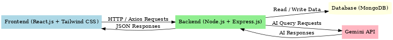

# 🗣️ Virtual Assistant


A **full-stack AI-powered Virtual Assistant** built with **React.js**, **Tailwind CSS**, **Node.js**, and **MongoDB**, using **Gemini API** for intelligent responses.  
This assistant listens to voice commands, processes them in real-time, and responds with relevant actions or spoken feedback—showcasing seamless integration of **frontend, backend, and AI services**.

---

## 🚀 Features

- 🎤 **Voice Command Processing** — Real-time speech recognition and execution.
- 🧠 **AI-Powered Responses** — Integrated with **Gemini API** for intelligent conversations.
- 🎨 **Modern UI** — Built with **React.js** + **Tailwind CSS** for a responsive, polished look.
- ⚡ **State Management** — Efficiently managed with React **hooks** & **state**.
- 🗄️ **MongoDB Database** — Stores relevant assistant data and configurations.
- 🌐 **Full-Stack Architecture** — Backend API powered by **Node.js + Express.js**.
- 🔐 **Authentication** — Secure user handling with **JWT**.
- 📦 **Modular Codebase** — Clean separation of concerns for scalability.

---

## 🛠 Tech Stack

| Layer        | Technology Used |
|--------------|----------------|
| **Frontend** | React.js, Tailwind CSS |
| **Backend**  | Node.js, Express.js |
| **Database** | MongoDB |
| **AI API**   | Gemini API |
| **State Management** | React Hooks & State |
| **Auth**     | JWT (JSON Web Token) |
| **Hosting**  | *(Add if deployed)* |

---

## 📂 Folder Structure

<details>
<summary>Click to expand</summary>

Virtual_Assistant/
├── backend/ # Node.js + Express backend
│ ├── config/ # DB & API config files
│ ├── controllers/ # API route handlers
│ ├── models/ # MongoDB Mongoose schemas
│ ├── routes/ # API endpoints
│ ├── utils/ # Helper functions
│ └── server.js # Backend entry point
│
├── frontend/ # React.js frontend
│ ├── src/
│ │ ├── components/ # UI components
│ │ ├── pages/ # Page-level components
│ │ ├── hooks/ # Custom React hooks
│ │ ├── assets/ # Images & icons
│ │ └── App.jsx # Main app component
│ ├── package.json
│ └── .gitignore
│
├── README.md
└── package.json

bash
Copy
Edit

</details>

---

## 🖼 Architecture



**Flow:**
1. User speaks into the **Frontend**.
2. **React.js** sends command to **Node.js Backend**.
3. Backend either:
   - Fetches data from **MongoDB**.
   - Sends request to **Gemini API** for AI responses.
4. Backend sends processed results back to the frontend.
5. Assistant speaks the response to the user.

---

## ⚙️ Installation & Running

### 1️⃣ Clone the Repository
```bash
git clone https://github.com/deepak108-sudo/Virtual_Assistant.git
cd Virtual_Assistant

2️⃣ Setup Backend
cd backend
npm install
Create a .env file in backend/ and add:

MONGO_URI=your_mongodb_connection_string
GEMINI_API_KEY=your_gemini_api_key
JWT_SECRET=your_secret_key
PORT=5000
Run backend:

npm start

3️⃣ Setup Frontend
cd ../frontend
npm install
npm run dev
📬 Contact
Author: Deepak Kumar
GitHub: deepak108-sudo
